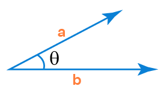

# Tangram

Um jogo simples de Tangram

## Implementação do ambiente

Utilizou-se three.js como _framework_ para desenhar mais facilmente
os polígonos no _browser_. Criou-se um plano paralelo ao plano do _browser_
em $z = 180$ como ambiente para desenho dos polígonos, e utilizou-se
uma câmera perspectiva, com um tronco de bases paralelas como campo de visão.
Os algoritmos foram todos implementados baseados no plano em $z = 180$. Para
isso, projetou-se somente a posição do cursor para coordenadas de dispositivo
normalizado da câmera, e então para o plano em $z = 180$.

## Algoritmo do ponto dentro do polígono
Para conseguir implementar a funcionalidade de arrastar cada uma das imagens,
era necessário identificar dentro de qual polígono o cursor do mouse estava
contido. Dessa forma, seria possível identificar qual o polígono que se desejava
movimentar.

### Ponto entre pontos
Tendo em mente esse fim do algoritmo do ponto dentro do polígono, primeiramente
se implementou um algoritmo que determinava se, dado um segmento delimitado por 2
pontos, um terceiro ponto colinear se encontrava entre estes dois pontos ou não, ou
seja, se ele se encontrava dentro do segmento. A figura a seguir ilustra os elementos
construídos para se determinar isso:

Através da geometria projetiva, pode-se determinar que:
$$r = p_1\times p_2,$$
onde $\times$ corresponde à operação de produto vetorial.

Denominando o ponto $p_4$ como sendo:
$$p_4 = (x_r, y_r, 0),$$
verifica-se que ele corresponde ao ponto no infinito de uma
reta arbitrária perpendicular à r. Pode-se assim determinar as
retas $s_1$ e $s_2$ como sendo:
$$s_i = p_i\times p_4$$
De posse destas retas, pode-se determinar facilmente que o ponto
se encontra dentro do segmento verificando se ele e $p_2$ estão
do mesmo lado da reta $s_1$ e se ele e $p_1$ estão do mesmo lado
da reta $s_2$:
$$(s_i\cdot p_{3 - i})(s_i\cdot p_3) \geq 0,$$
em que $\cdot$ corresponde à operação de produto escalar.

Vale notar que para esta equação funcionar, é necessário normalizar os pontos
quanto ao sinal do componente $w$.

### Interseção de dois segmentos
Agora que se pode determinar se um ponto está entre dois pontos em um segmento,
pode-se facilmente determinar se dois segmentos se intersectam:

O ponto $p_3$ pode ser achado diretamente por geometria projetiva:
$$p_3 = (p_1\cdot p_2)\cdot(p_4\cdot p_5)$$
De posse de $p_3$, basta verificar se ele está entre os pontos $p_1$
e $p_2$ e ao mesmo tempo entre os pontos $p_4$ e $p_5$ utilizando
o algoritmo proposto na seção anterior, para verificar se os
segmentos se intersectam.

### Ponto dentro do polígono
Agora que se tem um algoritmo para determinar se dois segmentos se intersectam,
pode-se determinar diretamente se um ponto $p$ está dentro de um polígono: denomina-se
o segmento $r$, que na verdade é uma semirreta, como sendo:
$$r = p\times p_\infty,$$
onde $p_\infty = (x_p, y_p, 0)$. Na prática, para funcionar, $p_\infty$ pode ser qualquer
ponto no infinito arbitrário. Escolheu-se $(x_p, y_p, 0)$ por simplicidade.

A seguir, computa-se para cada aresta do polígono se essa aresta e a semirreta $r$ se
intersectam. Determina-se desta forma quantas vezes o ponto bate no polígono quando é
estendido ao infinito, número que, se for ímpar, indica que o ponto está dentro do polígono.

## Rotacao

Primeiramente, calculamos o angulo entre os vetores $\theta$ que sao construidos da seguinte maneira:
$\vec{v} = \vec{cursor} - \vec{centerMesh}$

Utilizando o arco cosseno, encontramos o angulo entre 0 e 180 em radiano.  
Alem disso, eh analisado o sinal do produto vetorial entre o antigo vetor posicao e o novo para saber se girou em sentido horario ou anti-horario

